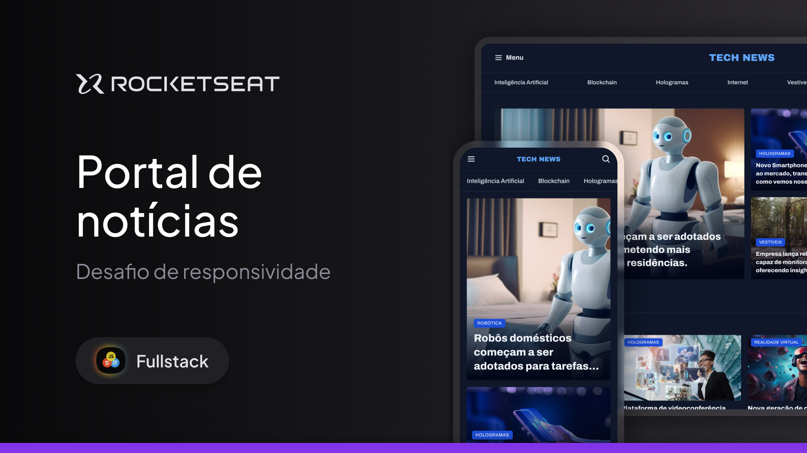

<h1 align="center"> Portal de notícias
 </h1>

<h2>Fala dev 👋🏼<h2>

Boas-vindas ao projeto Portal de notícias

Nesse projeto eu desenvolvi a homepage de um portal de notícias sobre tecnologia para ser visualizado em um desktop.

Esse é um dos projetos desenvolvidos em aula na formação Full-stack, um dos conteúdos de especialização da Rocketseat.

  <a href="#-tecnologias">Tecnologias</a>&nbsp;&nbsp;&nbsp;|&nbsp;&nbsp;&nbsp;
  <a href="#-projeto">Projeto</a>&nbsp;&nbsp;&nbsp;|&nbsp;&nbsp;&nbsp;
  <a href="#-layout">Layout</a>&nbsp;&nbsp;&nbsp;|&nbsp;&nbsp;&nbsp;
  <a href="#memo-licença">Licença</a>

  

 

  

## 🚀 Tecnologias

Esse projeto foi desenvolvido com as seguintes tecnologias:

- HTML e CSS
- Git e Github
- Figma

## 💻 Projeto

- [Acesse o projeto finalizado, online](https://viniciusalmeida-dev.github.io/Portal-de-noticias/)

## 🔖 Layout

Você pode visualizar o layout do projeto através [DESSE LINK](https://www.figma.com/design/E1b0j8DRe0bajoCivMlQOM/Portal-de-not%C3%ADcias--Community-?node-id=928-587&m=dev). É necessário ter conta no [Figma](https://figma.com) para acessá-lo.

## :memo: Licença

Esse projeto está sob a licença MIT.

---

Feito com ♥ by Rocketseat :wave: [Participe da nossa comunidade!](https://discord.gg/rocketseat)
